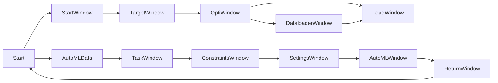

<h1 align="center">AUTOFlow</h1>

<div align="center">
  :steam_locomotive::train::train::train::train::train:
</div>
<div align="center">
  <strong>Bring your AI to the Edge</strong>
</div>
<div align="center">
  Autoflow is a tool that helps developers to implement machine learning (ML) faster and easier on embedded devices. The whole workflow of a data scientist should be covered. Starting from building the ML model to the selection of the target platform to the optimization and implementation of the model on the target platform.
</div>

<br />

<div align="center">
  <sub>A little framework that make your life easier. Built with ❤︎ by
  <a href="https://de.linkedin.com/in/marcus-r%C3%BCb-3b07071b2">Marcus Rüb</a> </a> and
  <a href="https://de.linkedin.com/in/daniel-konegen-a451271b3">
    Daniel Konegen
  </a>
</div>

## Table of Contents
- [Features](#features)
- [Install Guide](#Install-Guide)
- [Get Started](#get-started)
- [Events](#events)
- [State](#state)
- [Routing](#routing)
- [Server Rendering](#server-rendering)
- [Components](#components)
- [Optimizations](#optimizations)
- [FAQ](#faq)
- [API](#api)
- [See Also](#see-also)
- [Support](#support)

## Features
- __GUI interface:__ With this framework we offer a GUI, which should facilitate the entry into the AI as far as possible.
- __AUTOML:__ With the help of AUTOML techniques, ML models can be generated automatically. No experience with ML is required.
- __automatic compression:__ Existing ML models can be automatically compressed to reduce the size and speed of the model
- __automatic Code generation:__ The framework automatically generates code for the target platform.
- __different target platform:__ MCUs, FPGAs, Arduino, Raspberry PI etc.
- __easy to handle:__ ...

## Install Guide
```sh
$ Einfügen
```


## Get Started


## Flowchart



## See Also
- [AUTOKERAS](https://autokeras.com/) - Automl
- [HLS4ML](https://fastmachinelearning.org/hls4ml/) - FPGA Framework
- [Tensorflow Lite](https://www.tensorflow.org/lite/microcontrollers) - Tensorflow Lite for MCUs


## License
[MIT](https://tldrlegal.com/license/mit-license)

[nanocomponent]: https://github.com/choojs/nanocomponent
[nanolru]: https://github.com/s3ththompson/nanolru
[bankai]: https://github.com/choojs/bankai
[nanohtml]: https://github.com/choojs/nanohtml
[browserify]: https://github.com/substack/node-browserify
[budo]: https://github.com/mattdesl/budo
[es2020]: https://github.com/yoshuawuyts/es2020
[handbook]: https://github.com/yoshuawuyts/choo-handbook
[hyperx]: https://github.com/substack/hyperx
[morphdom-bench]: https://github.com/patrick-steele-idem/morphdom#benchmarks
[nanomorph]: https://github.com/choojs/nanomorph
[nanorouter]: https://github.com/choojs/nanorouter
[yo-yo]: https://github.com/maxogden/yo-yo
[unassertify]: https://github.com/unassert-js/unassertify
[window-performance]: https://developer.mozilla.org/en-US/docs/Web/API/Performance


